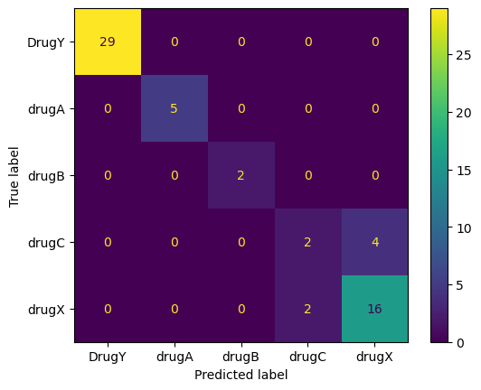

# Drug Prediction App [Click Here](https://huggingface.co/spaces/VirendraChavda/Drug_Classifier)
### Author: Virendrasinh Chavda

<p align="justify">
This repository contains a machine learning-powered web application for predicting suitable drugs for patients based on their medical details such as age, sex, blood pressure, cholesterol, and sodium-to-potassium ratio. The project uses a trained classification pipeline and deploys it through a user-friendly interface built with <strong>Gradio</strong>.
</p>

---

## Table of Contents
1. [Overview](#Overview)
2. [Installation](#Installation)
3. [Data](#Data)
4. [Features](#Features)
5. [Methodology](#Methodology)
6. [Results](#Results)
7. [Future Work](#Future-Work)
8. [Contributing](#Contributing)
9. [License](#License)

---

## Overview
<p align="justify">
Healthcare professionals often rely on complex medical tests to decide on the appropriate drugs for patients. This project automates drug prediction using machine learning. It simplifies decision-making by allowing users to input patient information and receive a predicted drug recommendation.
</p>

<p align="justify">
The project uses <strong>scikit-learn</strong> for building and training the machine learning pipeline, and <strong>Gradio</strong> for creating an interactive web application. This app can be deployed locally or on the web to provide accessible predictions for non-specialists.
</p>

---

## Installation

1. Clone this repository:
   ```bash
   git clone https://github.com/VirendraChavda/CICD-drug-classifier.git
   cd drug-prediction-app
   ```
2. Create a virtual environment and activate it:
   ```bash
   python -m venv env
   source env/bin/activate  # On Windows: env\Scripts\activate
   ```
3. Install the required dependencies:
   ```bash
   pip install -r requirements.txt
   ```
4. Run the Gradio app:
   ```bash
   python drug_app.py
   ```

The application will open in your default web browser.

## Data
The dataset used in this project is stored in the `drug.csv` file. It contains information about patients and their corresponding drug types. Key features include:

- <strong>Age</strong>: Age of the patient.
- <strong>Sex</strong>: Male (M) or Female (F).
- <strong>Blood Pressure</strong>: HIGH, NORMAL, or LOW.
- <strong>Cholesterol</strong>: HIGH or NORMAL.
- <strong>Na_to_K Ratio</strong>: Sodium-to-potassium ratio in blood.
- <strong>Drug</strong>: The target variable (e.g., DrugY, drugA, drugB, etc.).

The dataset is processed to train a classification model capable of predicting the drug type based on the above features.

## Features

### Interactive Web App
- Built using Gradio for seamless user interaction.
- Input fields include sliders, radio buttons, and examples.

### Machine Learning Model
- Uses a pre-trained scikit-learn classification pipeline for drug prediction.
- Deployed locally and customizable for web hosting.

### Predefined Examples
- Users can quickly test the app with preloaded examples.

## Methodology

### 1. Data Preprocessing
- Loaded the `drug.csv` dataset.
- Encoded categorical features (e.g., Sex, Blood Pressure).
- Split the dataset into training and test sets.

### 2. Model Training
- Used scikit-learn to build a classification pipeline.
- Trained the pipeline on patient features to predict drug labels.

### 3. Deployment
- Saved the trained model using `skops` for easy reuse.
- Developed an interactive interface using Gradio.

## Results
The classification model achieves high accuracy on the test set. Below is a confusion matrix visualizing the model's performance:

The model correctly classifies the majority of drug types, with minor misclassifications observed between DrugC and DrugX.



## Future Work

### Model Improvement
- Experiment with advanced models like Random Forests or XGBoost.

### Feature Engineering
- Add new medical features (e.g., BMI, medical history).

### Deployment
- Host the app on platforms like Hugging Face Spaces or Streamlit Cloud.

## Contributing
Contributions are welcome! Feel free to fork the repository, make improvements, and submit a pull request. If you encounter any issues, open a GitHub issue for discussion.

## License
This project is licensed under the MIT License. See the [LICENSE](./LICENSE) file for more details.
