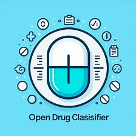

# Drug Classifier

Open the app in hugging face.

## Project Description
In this project, scikit-learn pipelines are used to train ML model to build a drug classifier. After training, the evaluation process is automated using CML. Lastly, the model is built and deployed as web application to Hugging Face Hub.

Training and evaluation is automated using GitHub actions.

> **LinkedIn:** https://www.linkedin.com/in/vc-ds/

